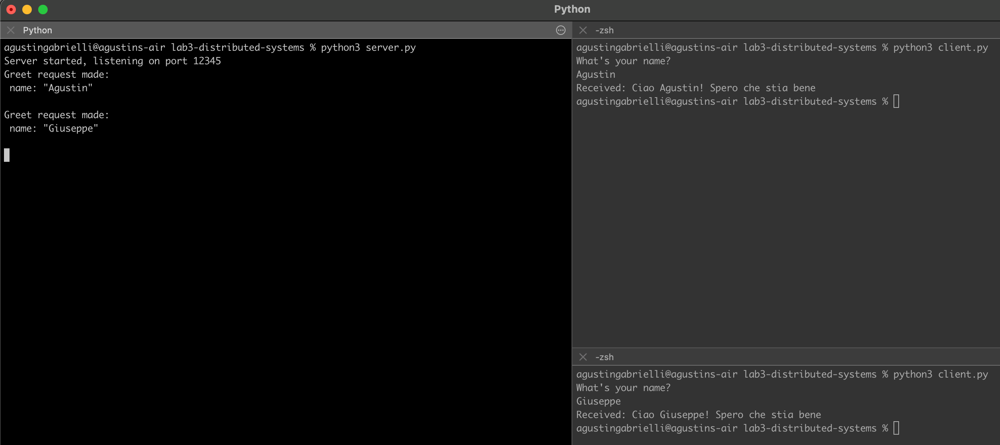

# lab3-distributed-systems

## Exercise Creating Simple gRPC Server and Clients

### Server Requirements: 
1. Create a gRPC server in Python that offers a basic service with the following functionality: 
* The server should provide a method called Greet that accepts a single string parameter and responds with a greeting message. 
* Define the service and the Greet method in a .proto file using gRPC IDL. 
2. Implement the server logic to handle the Greet method by generating a greeting message using the provided string parameter. 

### Client Requirements 
#### (Client 1): 
1. Create a Python client (Client 1) that interacts with the gRPC server. 
2. Connect to the server and call the Greet method with a custom name. 
3. Print the response received from the server, which should be a greeting message. 

#### Client Requirements (Client 2): 
1. Create a second Python client (Client 2) that interacts with the same gRPC server. 
2. Connect to the server and call the Greet method with a different custom name. 
3. Print the response received from the server, which should be a different greeting message.

## Example

A server and two clients that send different names.

## Apendix
Command to generate python code compiling the proto file
python3 -m grpc_tools.protoc -I protos --python_out=. --pyi_out=. --grpc_python_out=. protos/greet.proto
